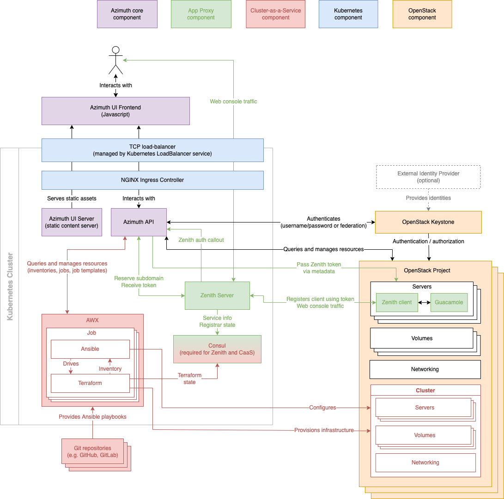

# Azimuth Architecture  <!-- omit in toc -->

This document describes the architecture of Azimuth in detail, including the integration with
the [Zenith application proxy](https://github.com/stackhpc/zenith) and the Cluster-as-a-Service
subsystem.

Azimuth consists of a [Python](https://www.python.org/) backend providing a REST API (different
to the OpenStack API) and a Javascript frontend written in [React](https://reactjs.org/). The
primary function of Azimuth is to be an OpenStack client, providing a simplified interface for
creating servers and volumes and making the networking as transparent as possible.

The application proxy and Cluster-as-a-Service subsystems provide additional functionality
above and beyond that provided by OpenStack, such as secure web consoles and the ability to
provision complex, multi-machine appliances.

> **NOTE**
>
> Before reading this document, please make sure you are familiar with the
> [Zenith Architecture](https://github.com/stackhpc/azimuth/blob/master/docs/architecture.md).
>
> This document treats Zenith as a black box, focusing on Azimuth's integration points.

## Contents  <!-- omit in toc -->

- [Architecture Diagram](#architecture-diagram)
- [Zenith integration](#zenith-integration)
  - [Authentication of proxied services](#authentication-of-proxied-services)
  - [Acquiring and distributing registrar tokens](#acquiring-and-distributing-registrar-tokens)
- [Cluster-as-a-Service (CaaS) subsystem](#cluster-as-a-service-caas-subsystem)
  - [AWX credentials](#awx-credentials)
  - [Use of Terraform for provisioning](#use-of-terraform-for-provisioning)
  - [Customising the parameter form for an appliance](#customising-the-parameter-form-for-an-appliance)

## Architecture Diagram

This diagram shows the components in the Azimuth Architecture. Components are colour-coded
to show which subsystem they belong to:

  * **Azimuth core component**: The component is composed of custom Azimuth code.
  * **App Proxy component**: The component is only deployed when the application proxy is enabled.
  * **Cluster-as-a-Service (CaaS) component**: The component is deployed when CaaS is enabled.
  * **Kubernetes component**: The component is part of the Kubernetes cluster.
  * **OpenStack component**: The component is part of the target OpenStack cloud.

## Zenith integration

### Authentication of proxied services

### Acquiring and distributing registrar tokens

## Cluster-as-a-Service (CaaS) subsystem

### AWX credentials

### Use of Terraform for provisioning

### Customising the parameter form for an appliance
